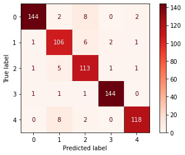

<a></a>

# [RNN] Untangle the Strings! -Article Categorizer-
Millions of articles generated and uploaded to the Internet every single day to feed the population of readers with insatiable hunger for knowledge. As such batches of new articles gushing into your server like tidal waves, sorting out articles one by one can be tedious and inefficient. Introducing your new nerdy assistant, who is here to perform the one and only task it is specialized at, the **Article Categorizer**! The name of assistant is self explanatory, [here](https://raw.githubusercontent.com/susanli2016/PyCon-Canada-2019-NLP-Tutorial/master/bbc-text.csv) is where it refined its expertise in classifying articles into **5 categories**: `'bussiness','entertainment','politics','sport','tech'`. 

# Model Accuracy
The model managed to achieve **94%** testing accuracy during evaluation:

| Classification Report | Confusion Matrix |
|-----------------------|------------------|
| |  |

## TensorBoard
[TensorBoard](https://www.tensorflow.org/tensorboard) is applied to visualize performance plots:


# Model Architecture
Model utilizes **2 layers of LSTM**, one of which is applied with `Bidirectional()`, `Embedding()` and `Masking()` precede the LSTM layers as described below:


To avoid overfitting `EarlyStopping()` is applied as well:
```
model.compile(optimizer='adam',loss=('categorical_crossentropy'),
              metrics=['acc'])

tb=TensorBoard(log_dir=LOG_PATH)
es=EarlyStopping(monitor='val_loss',patience=10)

hist=model.fit(x_train,y_train,batch_size=128,epochs=50,
               validation_data=(x_test,y_test),verbose=2,callbacks=[tb,es])
 ```
 
 # Data Summary
 Dataset has 2 columns `'category','text'` and has 2225 rows of articles. Dataset has fairly balanced distribution of articles across the 5 categories:
 
 
 
 ## Duplicated data?
 False alarm is raised when `df.duplicated().sum()` is executed:
 

  
99 rows returned as duplicate however upon further inspection the claimed duplicates contain different articles, hence will not be discarded.

# Preprocessing
**[RegEx](https://www.w3schools.com/python/python_regex.asp)** and `WordNetLemmatizer(),stopwords` from **[NLTK](https://www.nltk.org/)** are heavily relied upon to:
- Remove numbers and symbols
- Filter stop words and morphed words
```
for index,texts in enumerate(text):
    text[index]=re.sub('[^a-zA-Z]',' ',texts).lower().split()
    text[index]=[w for w in text[index] if not w in stop_words]
    text[index]=[lemmatizer.lemmatize(w) for w in text[index]]
```

## Tokenization
`Tokenizer()` is applied to numerize words in filtered articles. `tokenizer.word_index` revealed 24742 words are registered in Tokenizer hence approx. 75% of total registered words is set `vocab_size=18000`.

## Padding and Truncating
`length_of_text` in articles is calculated and tabulated to identify optimum length for padding:


Distribution of text length is positive skewed, median text length is 191, average text length is 218, hence `maxlen` is (190+220)/2=205

```
padded_text=pad_sequences(train_sequences,maxlen=max_len,truncating='post',padding='post')
```

## OneHotEncoder
`OneHotEncoder()` is applied on target column `'category'` to establish output dimension of model.

## Train test split
**Train** and **test** dataset are created using `train_test_split()` at ratio 7:3:

`x_train,x_test,y_train,y_test=train_test_split(padded_text,category,test_size=0.3,random_state=123)`

# Discussion
The model did not learn very well when it is only exposed to 2 ordinary LSTM layers, achieving 30% validation accuracy. With addition of `Bidirectional()` and `Embedding()` the validation accuracy fluctuates between 45% to 65% depending on the number of nodes in the hidden layers, with rare chance of scoring 80% validation accuracy (sadly I were not able to capture the rare moments). From then on I consulted **NLTK** sensei for guidance and it generously filtered out the critical words for classification. Here is some more ways to further improve **Article Categorizer**:
- [ ] Explore other NLP packages to use in preprocessing eg Word2vec.
- [ ] Incorporate pooling layers from Convolutional Neural Network algorithm into model.

Feel free to comment as I am open to suggestions to try out! 


